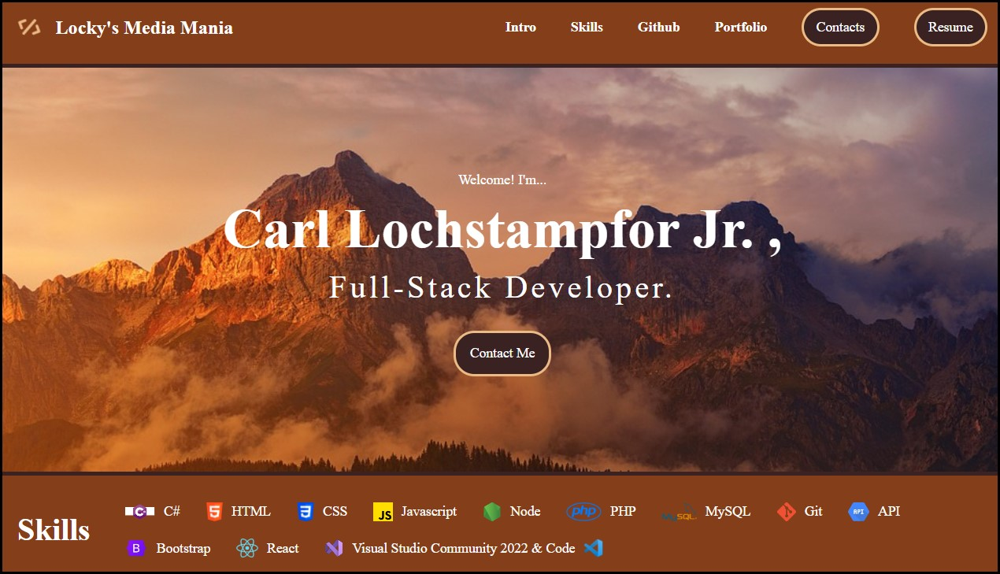
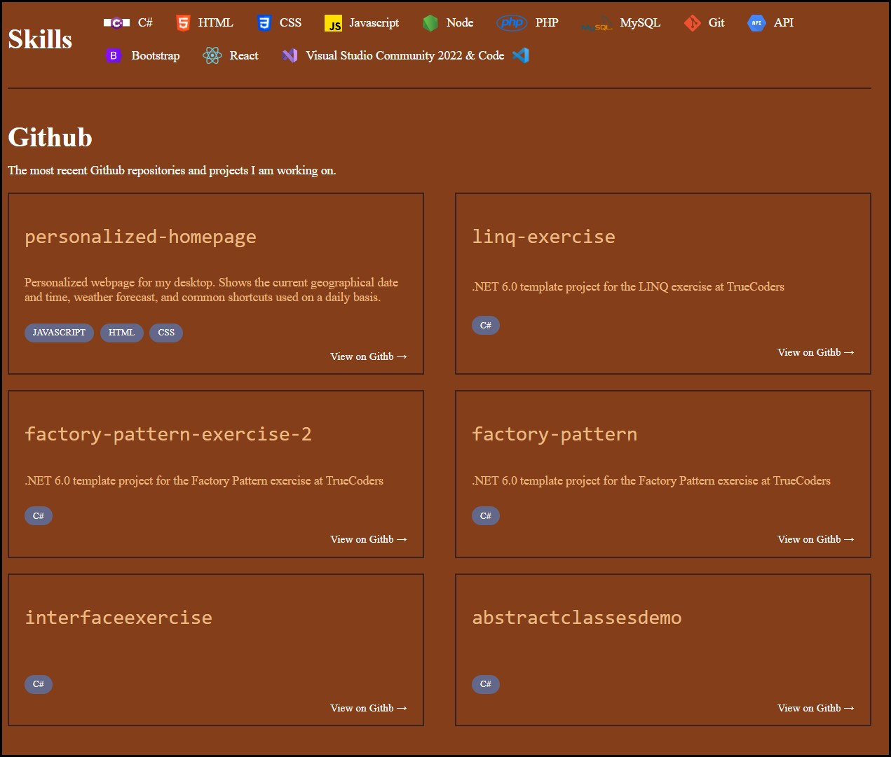
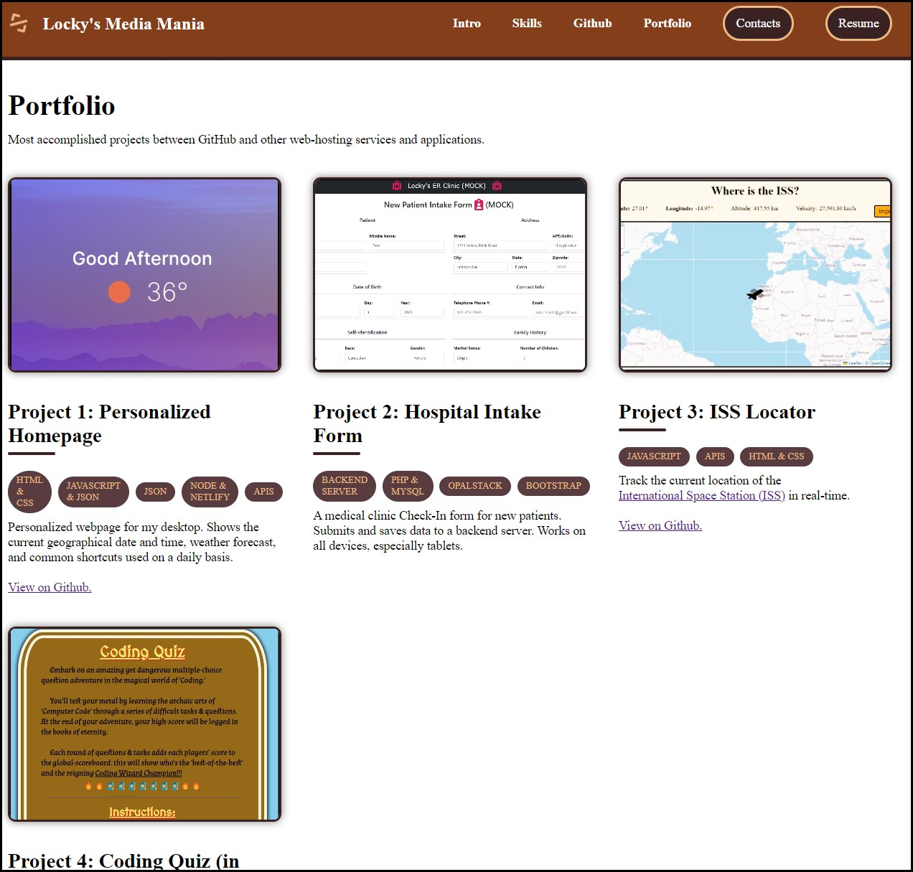
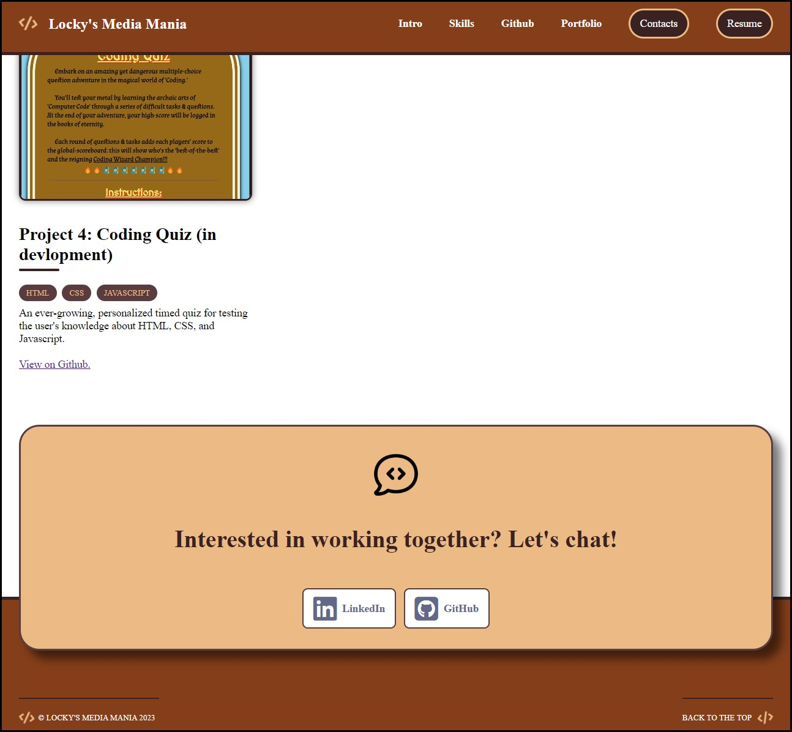

# portfolio-page

## Description:

- Develop a interactive web application from scratch that is BOTH mobile and acccesibly friendly.

- The web application harbors accomplished portfolio projects, with the adaptability to showcase future skills and talents as time progresses in the professional world.

- Technologies used for this project:
  - HTML
  - CSS
  - Javascript
  - GSAP
  - <a href="https://clochstampfor60.github.io/portfolio-page/" target="_blank" rel="noopener noreferrer">Font Awesome</a>
  - <a href="https://clochstampfor60.github.io/portfolio-page/" target="_blank" rel="noopener noreferrer">Coolors</a>

## User Story:

- AS AN employer,
- I WANT to view a potential employee's deployed portfolio of work samples,
- SO THAT I can review samples of their work and assess whether they're a good candidate for an open position.

## Acceptance Criteria:

<u>GIVEN</u> I need to sample a potential employee's previous work...

- <i>WHEN</i> I load their portfolio,
   <b>THEN</b> I am presented with the developer's name, a recent photo or avatar, and links to sections about them, their work, and how to contact them.

- <i>WHEN</i> I click one of the links in the navigation,
   <b>THEN</b> the UI scrolls to the corresponding section.

- <i>WHEN</i> I click on the link to the section about their work,
   <b>THEN</b> the UI scrolls to a section with titled images of the developer's applications.

- <i>WHEN</i> I am presented with the developer's first application,
   <b>THEN</b> that application's image should be larger in size than the others.

- <i>WHEN</i> I click on the images of the applications,
   <b>THEN</b> I am taken to that deployed application.

- <i>WHEN</i> I resize the page or view the site on various screens and devices,
   <b>THEN</b> I am presented with a responsive layout that adapts to my viewport.

## Final Product

  
	 

	
	

## Future Opportunities:

- As social media presence grows, add the corresponding icons and links to the CTA at the bottom of the page.
- Add additional animation and responsive 'eye-catchers' without going overboard. Can include different APIs to show my learning and growing wealth of knowledge.
- As my top GitHub projects expand, to save space and for easier reading for the user, add a Tab button above the Portfolio/Projects section. This feature will allow the User to move with ease between the project-cards inside the pool of options. This provides more space on the web-page without sacrificing other project-showing and general visibility.
- Add a separate 'Contact Form' that sends a message directly to my business email account. (Currently using LinkedIn and GitHub, as both web-applications offer SIGNIFICANTLY more options, visibility, and security from hackers and spammers).
- Move the dynamic animations and styling from the Index.html file to the CSS. This will automatic and simplify future changes instead of manually checking each section.

---

## Student's Submitted Work:

- URL of the <u>deployed application</u>: <a href="https://clochstampfor60.github.io/portfolio-page/" target="_blank" rel="noopener noreferrer">Portfolio Page</a>
- URL of the application's <u>GitHub Repository</u>: [CLocky60](#)

---

## License

- This project is licensed under the terms of the MIT license.
- This project is for developer use only.

---
